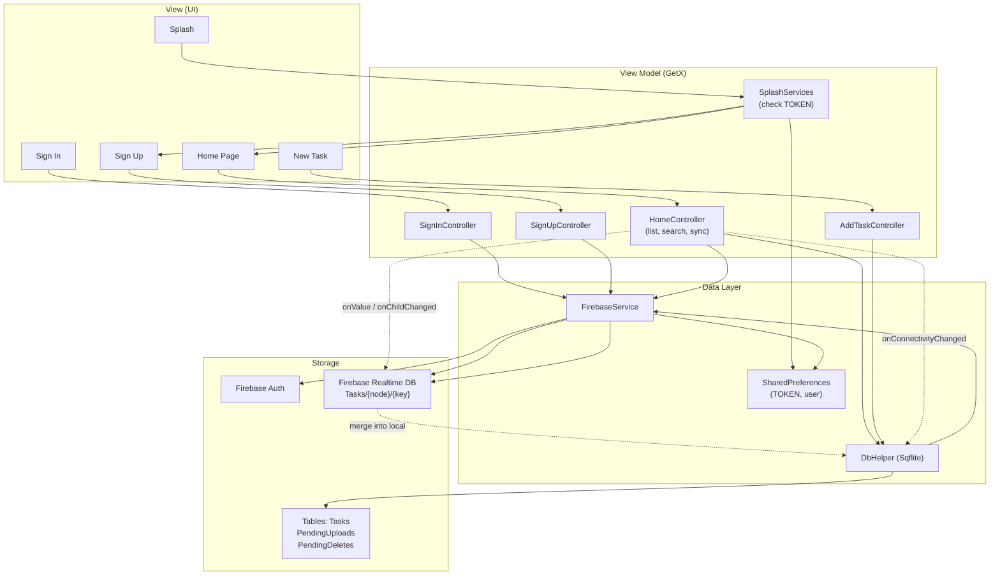
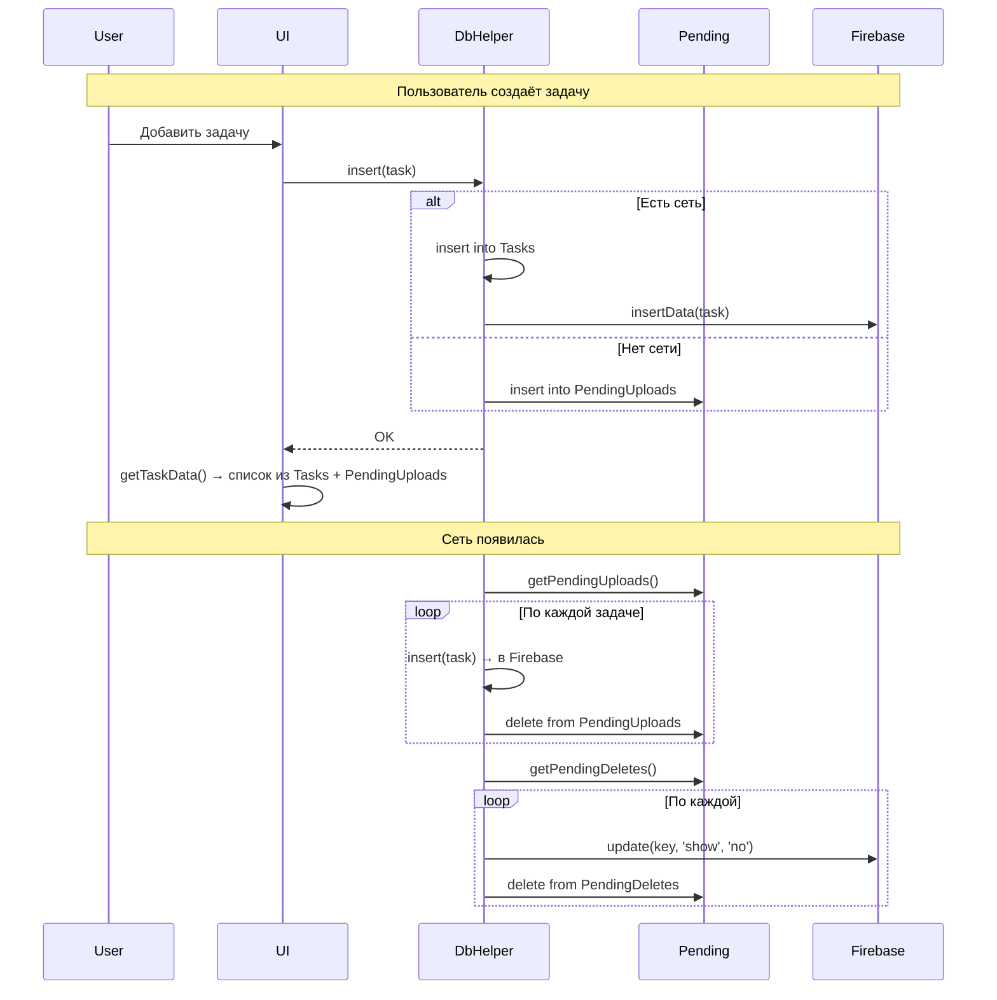
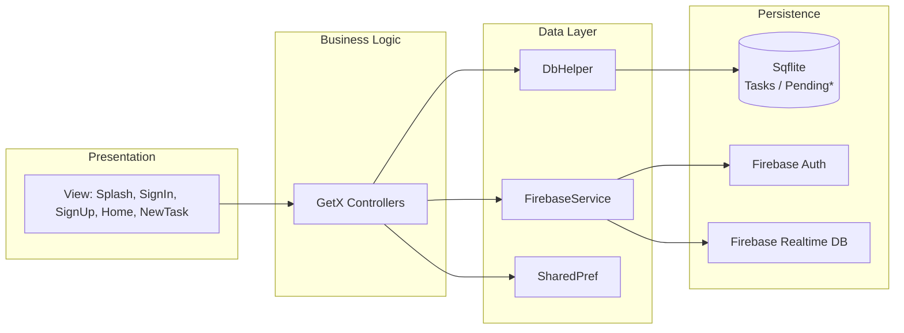

# Task-Sync-Pro-Flutter: архитектура и что взять в Jarvis

Референс: [GitHub — Hamad-Anwar/Task-Sync-Pro-Flutter](https://github.com/Hamad-Anwar/Task-Sync-Pro-Flutter)

---

## 1. Архитектура приложения (обзор)

Приложение построено по слоям: **Model → Data (DB + Network) → View Model (GetX) → View**. Данные живут локально в Sqflite и дублируются в Firebase Realtime Database; при отсутствии сети операции пишутся в очереди и выполняются при восстановлении связи.

---

## 2. Структура проекта (lib/)

```
lib/
├── main.dart                 # Firebase.init, GetMaterialApp, routes
├── model/
│   └── task_model.dart       # TaskModel (key, title, category, description, image, priority, time, date, show, progress, status)
├── data/
│   ├── network/
│   │   └── firebase/
│   │       └── firebase_services.dart   # Auth, Realtime DB (insert/update), Google/Apple sign-in
│   └── shared pref/
│       └── shared_pref.dart   # UserPref: TOKEN, name, email, password, node
├── view model/
│   ├── DbHelper/
│   │   └── db_helper.dart    # Sqflite: Tasks, PendingUploads, PendingDeletes + sync logic
│   ├── controller/
│   │   ├── home_controller.dart      # List, Firebase listeners, connectivity, search
│   │   ├── add_task_controller.dart  # Add/edit task
│   │   ├── signin_controller.dart
│   │   └── signup_controller.dart
│   └── services/
│       └── splash_services.dart      # Check TOKEN → SignUp or Home after 2s
├── view/
│   ├── splash/                # Splash screen
│   ├── sign in/                # Login
│   ├── sign up/                # Register
│   ├── home page/              # List of tasks
│   ├── new task/               # Add task screen
│   └── common widgets/         # e.g. back_button
├── res/
│   ├── app_color.dart
│   ├── assets/
│   └── routes/
│       ├── app_routes.dart     # GetPage list
│       └── routes.dart         # Route name constants
└── utils/
    └── utils.dart              # validateEmail, showSnackBar, formatDate, showWarningDialog
```

---

## 3. Логика данных и синхронизации

### 3.1 Модель задачи (TaskModel)

- **key** — уникальный id (используется как ключ в Firebase и в таблицах).
- **title, category, description, image** — контент.
- **periority** (опечатка в коде), **time, date** — приоритет и время.
- **show** — флаг видимости: при "удалении" ставится `show = 'no'` (мягкое удаление).
- **progress, status** — прогресс и статус задачи.

Сериализация: `fromMap` / `toMap` для Sqflite и Firebase.

### 3.2 Локальная БД (DbHelper, Sqflite)

Три таблицы:

| Таблица           | Назначение |
|-------------------|------------|
| **Tasks**         | Основные задачи (то, что видит пользователь). |
| **PendingUploads**| Задачи, созданные офлайн; при появлении сети отправляются в Firebase и удаляются из очереди. |
| **PendingDeletes**| Задачи, помеченные к удалению (show=no) офлайн; при появлении сети обновляют Firebase и удаляются из очереди. |

Логика в `insert()`:

- Если есть сеть (Wi‑Fi или mobile) — пишем в `Tasks` и сразу вызываем `FirebaseService.insertData(model)`.
- Если сети нет — пишем только в `PendingUploads`.

При `removeFromList()` (мягкое удаление):

- В `Tasks` обновляем `show = 'no'`.
- Если онлайн — в Firebase обновляем поле `show`.
- Если офлайн — запись добавляется в `PendingDeletes`.

### 3.3 Синхронизация при восстановлении сети (HomeController)

В `HomeController` подписка на `connectivity.onConnectivityChanged`:

1. При переходе в **wifi/mobile**:
   - Читаем `PendingUploads`, для каждой вызываем `db.insert(task)` (он уже пойдёт в Firebase, т.к. сеть есть), затем удаляем из `PendingUploads`.
   - Читаем `PendingDeletes`, для каждой вызываем `FirebaseService.update(key, 'show', 'no')` и удаляем из `PendingDeletes`.
2. Вызываем `getTaskData()` — обновляем список с учётом локальных и удалённых данных.

### 3.4 Real-time из Firebase (HomeController)

- Подписка на `FirebaseDatabase.ref('Tasks').child(node).onValue`:
  - При любом изменении дерева задач приходят все данные.
  - Для каждой задачи с сервера проверяют `db.isRowExists(key, 'Tasks')`; если такой нет — вставляют в локальную БД и снова вызывают `getTaskData()`.
- Подписка на `onChildChanged`:
  - Обновляют соответствующую задачу в локальной БД через `db.update(...)` и снова `getTaskData()`.

В итоге: локальная БД — источник правды для UI; Firebase — облачная копия и канал рассылки изменений на другие устройства.

### 3.5 Аутентификация и маршрутизация

- **Firebase Auth**: email/password, Google Sign-In, заглушка для Apple.
- **SharedPreferences**: после входа сохраняют TOKEN (uid), имя, email, node (префикс email до @) для пути в Realtime DB.
- **Splash**: через 2 секунды проверяют TOKEN; если нет — экран SignUp, иначе — Home.

Данные в Firebase лежат по пути: `Tasks / {node} / {taskKey}` и `Accounts / {node}` (имя, email, пароль — в открытом виде, что небезопасно).

---

## 4. Схема архитектуры (потоки данных)

Ниже — упрощённая схема: где живут данные, как они синхронизируются и как связаны экраны.



---

## 5. Схема синхронизации (офлайн / онлайн)



---

## 6. Что полезного можно добавить в Jarvis

| Идея / решение в Task-Sync-Pro | Есть в Jarvis? | Рекомендация для Jarvis |
|--------------------------------|-----------------|--------------------------|
| **Очереди офлайн-изменений** (PendingUploads / PendingDeletes) | Нет в явном виде; CloudSync опирается на общий store | Ввести явные очереди «ожидающих синка» операций и при восстановлении сети применять их к iCloud/CloudKit — меньше конфликтов и прозрачнее отладка. |
| **Реакция на восстановление сети** | NetworkMonitor есть, автоматический «flush» при reconnect не описан | Явно по смене `isConnected` вызывать полную синхронизацию (pull + push pending). |
| **Real-time обновления с сервера** | iCloud KVS — eventual consistency | Для «как у них» можно позже рассмотреть CloudKit subscriptions или другой push-канал; в доке зафиксировать как улучшение. |
| **Экран Splash + проверка входа** | Нет отдельного splash и нет auth | Опционально: splash с загрузкой темы/данных; при появлении auth — проверка сессии и маршрут на логин или главный экран. |
| **Единый Toast/Snackbar с иконкой** | Разрозненные алерты/сообщения | Ввести один хелпер типа `Utils.showSnackBar(title, message, icon)` для успеха/ошибки/инфо. |
| **Диалог подтверждения удаления** | Есть confirmationDialog | Оставить как есть; при необходимости вынести в один переиспользуемый метод по аналогии с `showWarningDialog`. |
| **Поле прогресса задачи (progress %)** | Только isCompleted | При появлении подзадач или чек-листов — добавить progress; не обязательно в первой итерации. |
| **Приоритет задачи (priority)** | Нет отдельного поля | Можно добавить priority (low/medium/high) или использовать категории/теги. |
| **Валидация email** | Нет сценариев с email | При появствии полей email (настройки, экспорт) — использовать валидацию как в их `email_validator`. |
| **Кастомная кнопка «Назад» с анимацией** | Системная навигация | Низкий приоритет; при желании — переиспользуемый компонент с анимацией как в их `back_button`. |

---

## 7. Краткое сравнение стека

| Аспект | Task-Sync-Pro-Flutter | Jarvis |
|--------|------------------------|--------|
| Платформа | Flutter (Android, iOS) | Нативный Swift (iOS, iPadOS, macOS, watchOS) |
| Локальное хранилище | Sqflite (3 таблицы) | In-memory + UserDefaults/файлы, NSUbiquitousKeyValueStore (iCloud) |
| Облако | Firebase Realtime Database | iCloud (KVS, опционально CloudKit) |
| Auth | Firebase Auth (email, Google, Apple) | Нет (локальное устройство / Apple ID через систему) |
| State / навигация | GetX (Rx, GetPage) | SwiftUI (@Published, ObservableObject, sheets) |
| Офлайн | Явные очереди Pending* + connectivity | CloudSync с очередью и разрешением конфликтов по дате изменения |
| Real-time | Слушатели onValue/onChildChanged | Нет (eventual) |

---

Итог: у Task-Sync-Pro-Flutter наиболее полезны для Jarvis **паттерн офлайн-очередей**, **явная реакция на восстановление сети** и идеи по **унификации уведомлений и опциональному splash/auth**. Остальное (модель задачи, приоритет, прогресс) можно выборочно переносить по мере появления соответствующих фич в Jarvis.

---

## 8. Общая схема приложения (уровни)



*Схемы в формате Mermaid можно просматривать в GitHub, в VS Code/Cursor (с расширением Markdown Preview Mermaid) или на [mermaid.live](https://mermaid.live).*
